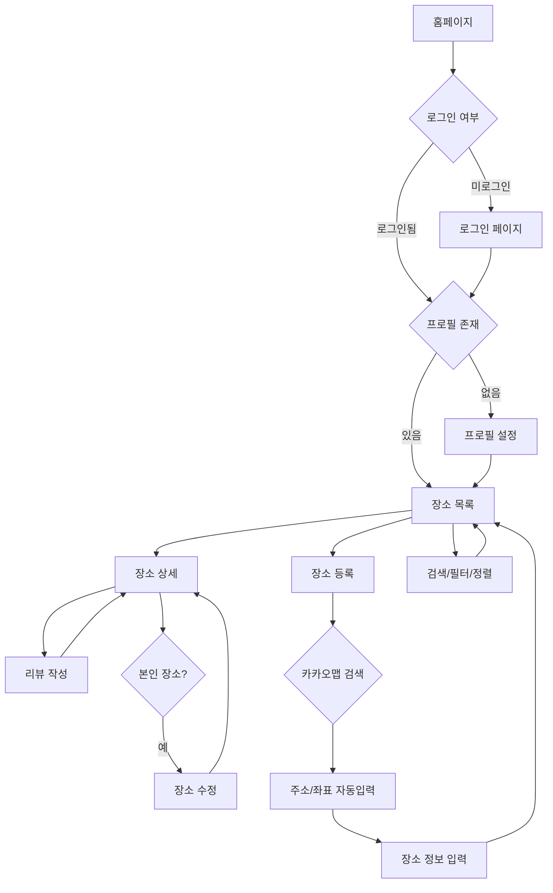

# 장소 기록 관리 웹 MVP PRD

## 🎯 핵심 정보

**목적**: 로그인한 사용자가 유기명으로 방문한 맛집과 장소를 기록하고, 다른 사용자들과 별점 및 리뷰를 공유하는 소셜 장소 추천 서비스

**사용자**: 자신이 방문한 장소를 기록하고 공유하고 싶은 사람, 다른 사람들의 장소 추천을 찾고 평가하고 싶은 사람

## 🚶 사용자 여정



## ⚡ 기능 명세

### 1. MVP 핵심 기능

| 기능 ID | 기능명         | 설명                                                                                 | 관련 페이지      |
| ------- | -------------- | ------------------------------------------------------------------------------------ | ---------------- |
| F001    | 장소 등록      | 카카오맵 API 키워드 검색으로 주소+좌표 자동 입력, 이름/설명/카테고리 작성            | 장소 등록 페이지 |
| F002    | 장소 목록 조회 | 등록된 모든 장소를 카드형 리스트로 표시 (이름, 카테고리, 평균 별점, 리뷰 수, 작성자) | 장소 목록 페이지 |
| F003    | 장소 상세 조회 | 장소 정보 전체 + 지도 + 리뷰 목록 표시                                               | 장소 상세 페이지 |
| F004    | 장소 수정      | 본인이 등록한 장소만 수정 가능 (카카오맵 재검색 포함)                                | 장소 수정 페이지 |
| F005    | 장소 삭제      | 본인이 등록한 장소만 삭제 가능 (연관 리뷰 cascade 삭제)                              | 장소 상세 페이지 |
| F006    | 리뷰 작성      | 장소당 1인 1리뷰, 별점(1-5) + 텍스트 작성                                            | 장소 상세 페이지 |
| F007    | 리뷰 수정      | 본인 리뷰만 수정 가능                                                                | 장소 상세 페이지 |
| F008    | 리뷰 삭제      | 본인 리뷰만 삭제 가능                                                                | 장소 상세 페이지 |
| F009    | 검색           | 장소 이름으로 실시간 검색                                                            | 장소 목록 페이지 |
| F010    | 카테고리 필터  | 맛집/카페/관광지/숙소/술집/기타 필터링                                               | 장소 목록 페이지 |
| F011    | 정렬           | 최신순/평점 높은 순/리뷰 많은 순 정렬                                                | 장소 목록 페이지 |
| F012    | 페이지네이션   | 12개 단위 페이징                                                                     | 장소 목록 페이지 |

### 2. MVP 필수 지원 기능

| 기능 ID | 기능명           | 설명                                            | 관련 페이지        |
| ------- | ---------------- | ----------------------------------------------- | ------------------ |
| F013    | 이메일 인증      | 이메일/비밀번호 회원가입 및 로그인 (기존 구현)  | 인증 페이지        |
| F014    | Google OAuth     | 구글 소셜 로그인 (기존 구현)                    | 인증 페이지        |
| F015    | 프로필 설정      | 최초 로그인 시 닉네임/자기소개 작성 (기존 구현) | 프로필 설정 페이지 |
| F016    | 프로필 수정      | 닉네임/자기소개 변경 (기존 구현)                | 프로필 수정 페이지 |
| F017    | 로그아웃         | 세션 종료 (기존 구현)                           | 전역 내비게이션    |
| F018    | 다크/라이트 테마 | 테마 토글 (기존 구현)                           | 전역 내비게이션    |

### 3. MVP 이후 기능 (제외)

- 장소 사진 업로드/갤러리
- 리뷰 사진 첨부
- 리뷰 좋아요/신고
- 사용자 팔로우/팔로잉
- 장소 북마크/저장
- 방문 체크인
- 지도 기반 탐색 (클러스터링)
- 해시태그
- 공유하기 (SNS)
- 푸시 알림
- 관리자 대시보드

## 📱 메뉴 구조

```
홈
└─ 로그인 (F013, F014)
   └─ 프로필 설정 (F015)
      └─ 보호된 영역
         ├─ 장소 목록 (F002, F009, F010, F011, F012)
         │  ├─ 장소 등록 (F001)
         │  └─ 장소 상세 (F003, F005, F006, F007, F008)
         │     └─ 장소 수정 (F004)
         └─ 내비게이션
            ├─ 프로필 수정 (F016)
            ├─ 테마 전환 (F018)
            └─ 로그아웃 (F017)
```

## 📄 페이지별 상세 기능

### 1. 장소 목록 페이지

**역할**: 등록된 장소 탐색 및 접근 진입점

**사용자 행동**:

- 장소 카드 클릭 → 장소 상세 이동
- 장소 등록 버튼 클릭 → 장소 등록 페이지 이동
- 검색어 입력 → 실시간 필터링
- 카테고리 선택 → 해당 카테고리만 표시
- 정렬 방식 선택 → 목록 재정렬
- 페이지 번호 클릭 → 해당 페이지 이동

**진입 조건**: 인증 + 프로필 완료

**기능 목록**:

- 장소 카드형 리스트 (이름, 카테고리, 평균 별점, 리뷰 수, 작성자 닉네임)
- 검색 입력 필드
- 카테고리 드롭다운 (전체/맛집/카페/관광지/숙소/술집/기타)
- 정렬 드롭다운 (최신순/평점 높은 순/리뷰 많은 순)
- 페이지네이션 (12개 단위)
- 장소 등록 버튼

**구현 기능**: F002, F009, F010, F011, F012

---

### 2. 장소 등록 페이지

**역할**: 새로운 장소 등록

**사용자 행동**:

- 카카오맵 검색창에 키워드 입력 → 검색 결과 목록 표시
- 검색 결과 선택 → 주소/좌표 자동 입력
- 장소 이름, 카테고리, 설명 작성
- 등록 버튼 클릭 → 장소 목록으로 이동

**진입 조건**: 인증 + 프로필 완료

**기능 목록**:

- 카카오맵 키워드 검색 위젯
- 검색 결과 목록 (최대 5개)
- 선택된 장소 미리보기 지도
- 장소 이름 입력 필드 (자동 입력 가능)
- 주소 표시 필드 (읽기 전용)
- 카테고리 선택 드롭다운
- 설명 텍스트 영역
- 등록/취소 버튼

**구현 기능**: F001

---

### 3. 장소 상세 페이지

**역할**: 장소 정보 상세 표시 및 리뷰 관리

**사용자 행동**:

- 장소 정보 조회 (이름, 주소, 카테고리, 설명, 평균 별점, 리뷰 수, 작성자)
- 지도에서 위치 확인
- 리뷰 목록 조회 (별점, 내용, 작성자, 작성일)
- 본인 장소인 경우: 수정/삭제 버튼 표시
- 리뷰 미작성 시: 리뷰 작성 폼 표시
- 본인 리뷰인 경우: 수정/삭제 버튼 표시

**진입 조건**: 인증 + 프로필 완료

**기능 목록**:

- 장소 정보 카드 (이름, 주소, 카테고리, 설명, 평균 별점, 리뷰 수, 작성자 닉네임)
- 카카오맵 위치 표시 (마커)
- 본인 장소일 경우: 수정/삭제 버튼
- 리뷰 작성 폼 (별점 선택 + 텍스트 입력)
- 리뷰 목록 (작성자 닉네임, 별점, 내용, 작성일, 본인 리뷰일 경우 수정/삭제 버튼)

**구현 기능**: F003, F005, F006, F007, F008

---

### 4. 장소 수정 페이지

**역할**: 본인이 등록한 장소 수정

**사용자 행동**:

- 기존 정보 표시 (이름, 주소, 카테고리, 설명, 위치)
- 카카오맵 재검색으로 위치 변경 가능
- 이름, 카테고리, 설명 수정
- 저장 버튼 클릭 → 장소 상세로 이동

**진입 조건**: 인증 + 프로필 완료 + 본인 장소

**기능 목록**:

- 기존 정보 로드
- 카카오맵 키워드 검색 위젯 (위치 변경 시)
- 장소 이름 입력 필드
- 카테고리 선택 드롭다운
- 설명 텍스트 영역
- 저장/취소 버튼

**구현 기능**: F004

---

### 5. 프로필 설정 페이지 - 기존 구현

**역할**: 최초 로그인 후 프로필 생성

**구현 기능**: F015

---

### 6. 프로필 수정 페이지 - 기존 구현

**역할**: 닉네임, 자기소개 수정

**구현 기능**: F016

---

### 7. 인증 페이지 - 기존 구현

**역할**: 회원가입, 로그인, 비밀번호 재설정

**구현 기능**: F013, F014

## 🗄️ 데이터 모델

### places (장소)

| 필드명       | 타입             | 제약조건                  | 설명                                             |
| ------------ | ---------------- | ------------------------- | ------------------------------------------------ |
| id           | UUID             | PRIMARY KEY               | 장소 고유 식별자                                 |
| user_id      | UUID             | NOT NULL, FK → auth.users | 작성자 ID                                        |
| name         | TEXT             | NOT NULL                  | 장소 이름                                        |
| description  | TEXT             |                           | 장소 설명                                        |
| category     | ENUM             | NOT NULL                  | restaurant/cafe/attraction/accommodation/bar/etc |
| address      | TEXT             | NOT NULL                  | 주소                                             |
| latitude     | DOUBLE PRECISION | NOT NULL                  | 위도                                             |
| longitude    | DOUBLE PRECISION | NOT NULL                  | 경도                                             |
| avg_rating   | NUMERIC(2,1)     | DEFAULT 0                 | 평균 별점 (0.0 ~ 5.0)                            |
| review_count | INTEGER          | DEFAULT 0                 | 리뷰 개수                                        |
| created_at   | TIMESTAMPTZ      | DEFAULT now()             | 생성 일시                                        |
| updated_at   | TIMESTAMPTZ      | DEFAULT now()             | 수정 일시                                        |

**인덱스**: user_id, category, avg_rating, created_at

**RLS**: 인증 사용자 전체 조회, 본인만 INSERT/UPDATE/DELETE

---

### reviews (리뷰)

| 필드명                    | 타입        | 제약조건                         | 설명             |
| ------------------------- | ----------- | -------------------------------- | ---------------- |
| id                        | UUID        | PRIMARY KEY                      | 리뷰 고유 식별자 |
| place_id                  | UUID        | NOT NULL, FK → places            | 장소 ID          |
| user_id                   | UUID        | NOT NULL, FK → auth.users        | 작성자 ID        |
| rating                    | SMALLINT    | NOT NULL, CHECK (1 ≤ rating ≤ 5) | 별점             |
| content                   | TEXT        |                                  | 리뷰 내용        |
| created_at                | TIMESTAMPTZ | DEFAULT now()                    | 생성 일시        |
| updated_at                | TIMESTAMPTZ | DEFAULT now()                    | 수정 일시        |
| UNIQUE(place_id, user_id) |             |                                  | 장소당 1인 1리뷰 |

**인덱스**: place_id, user_id

**RLS**: 인증 사용자 전체 조회, 본인만 INSERT/UPDATE/DELETE

**트리거**: 리뷰 생성/수정/삭제 시 places 테이블의 avg_rating, review_count 자동 갱신

---

### profiles (프로필) - 기존 구현

| 필드명     | 타입        | 제약조건                     | 설명       |
| ---------- | ----------- | ---------------------------- | ---------- |
| id         | UUID        | PRIMARY KEY, FK → auth.users | 사용자 ID  |
| username   | TEXT        | UNIQUE                       | 사용자명   |
| full_name  | TEXT        |                              | 표시 이름  |
| avatar_url | TEXT        |                              | 아바타 URL |
| created_at | TIMESTAMPTZ | DEFAULT now()                | 생성 일시  |
| updated_at | TIMESTAMPTZ | DEFAULT now()                | 수정 일시  |

**RLS**: 인증 사용자 전체 조회, 본인만 INSERT/UPDATE

## 🛠️ 기술 스택

### 프론트엔드

- **프레임워크**: Next.js 15.1.6 (App Router)
- **UI 라이브러리**: React 19.0.0
- **언어**: TypeScript 5.x
- **스타일링**: Tailwind CSS 3.4.1
- **UI 컴포넌트**: shadcn/ui (new-york 스타일) + Lucide Icons
- **테마**: next-themes 0.4.6

### 백엔드

- **BaaS**: Supabase (인증 + PostgreSQL + RLS)
- **서버 로직**: Next.js Server Actions
- **DB 클라이언트**: @supabase/ssr 0.6.2

### 외부 API

- **지도/검색**: 카카오맵 API (키워드 검색 + 지도 표시)

### 개발 도구

- **린터**: ESLint 9.x
- **코드 포매터**: Prettier (설정됨)
- **커밋 훅**: Husky (설정됨)
- **타입 생성**: Supabase CLI (database.types.ts 자동 생성)

### 호스팅

- **프론트엔드**: Vercel (권장)
- **백엔드**: Supabase Cloud
